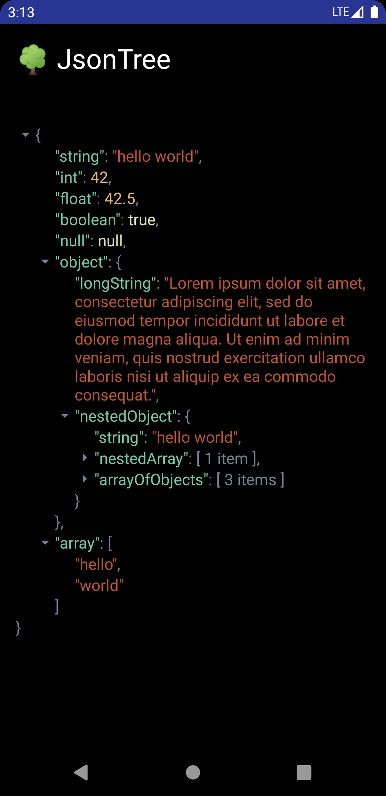
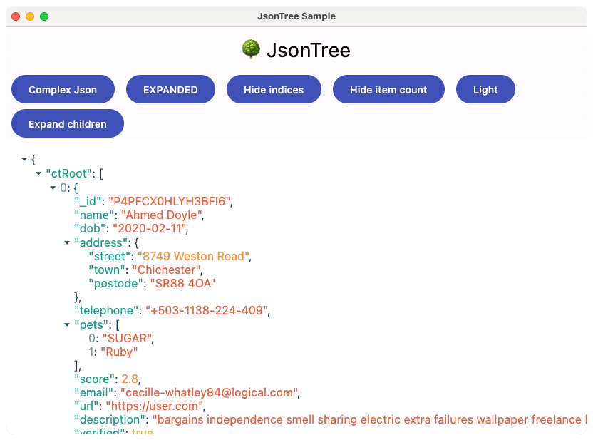

# 🌳 JsonTree

 
 
<br /><br />
JsonTree is a Compose Multiplatform library to display JSON data in Compose with syntax highlighting and more.
<br /><br />

<p float="left">


</p>


## About

JsonTree is an Compose Multiplatform library to display formatted JSON data in Compose.
Users can expand/collapse objects and arrays, which can also display additional info like item counts and item indices for arrays. 
JsonTree offers several customizations for visual appearance like syntax highlighting, text style and icons.

## Download

See `maven-central` tag at the top for the latest version.

```kotlin
dependencies {
    // add this to commonMain in a multiplatform project
    implementation("com.sebastianneubauer.jsontree:jsontree:latest-version")
}
```

### Snapshots

Add the sonatype snapshot repository to your gradle setup and add the dependency from above. See `snapshot` tag at the top for the latest version.

```kotlin
maven { url = uri("https://s01.oss.sonatype.org/content/repositories/snapshots/") }
```

## How to use

Add `JsonTree` to your Compose UI and customize it with the following options. Get started by only providing your JSON data and a Composable for the initial loading.
```kotlin
JsonTree(
    json = "{ \"key\": \"value\" }",
    onLoading = { Text(text = "Loading...") }
)
```
For more customization, use the following parameter.

```kotlin
JsonTree(
    // The modifier of JsonTree
    modifier = Modifier,
    // Your json data
    json = "{ \"key\": \"value\" }",
    // The Composable to be rendered during the initial loading
    onLoading = { Text(text = "Loading...") },
    // The initial state of the tree. Expand the first item or expand/collapse all items
    initialState = TreeState.FIRST_ITEM_EXPANDED,
    // The content padding for the internal LazyColumn
    contentPadding = PaddingValues(16.dp),
    // The color palette for your json tree
    colors = TreeColors(
        keyColor = Color.Blue,
        stringValueColor = Color.Red,
        numberValueColor = Color.Green,
        booleanValueColor = Color.Yellow,
        nullValueColor = Color.Yellow,
        indexColor = Color.Black,
        symbolColor = Color.Black,
        iconColor = Color.Black,
    ),
    // The arrow icon for collapsable items
    icon = ImageVector.vectorResource(R.drawable.my_arrow_icon),
    // The size of the arrow icon
    iconSize = 20.dp,
    // The TextStyle to use for the json tree
    textStyle = TextStyle(/*...*/),
    // If true, then array items will show their index.
    showIndices = false,
    // If true, then arrays and objects will show the amount of child items when collapsed.
    showItemCount = true,
    // If true, then children without siblings will be expanded automatically with their parents, 
    // until there are none or multiple on a level.
    expandSingleChildren = false,
    // The current state of the search result. Can be used to search the json for keys and values.
    searchState = rememberSearchState(),
    // The LazyListState of the LazyColumn which renders the json tree.
    lazyListState = rememberLazyListState(),
    // A callback method which is called when the provided json data can't be parsed.
    onError = { throwable: Throwable -> /* Do something */ }
)
```

## Search

JsonTree can be searched for keys and values by using the `searchState` parameter. The SearchState provides the following data about the current results. For an example on how to implement a search UI see the sample [here](sample/src/commonMain/kotlin/App.kt).

- `query` - The string which should be searched in the JsonTree
- `totalResults` - The total count of results for the query
- `selectedResultIndex` - The index of the currently selected result
- `selectedResultListIndex` - The index of the list item in which the selected result is located
- `selectNext()` - Selects the next result
- `selectPrevious()` - Selects the previous result

### Limitations

- Using the search will always expand the whole JsonTree to find and show all results
- Changing the JsonTree list by collapsing an item will clear the search state, since the new list won't match the search state anymore

## Minimum Requirements

- Android minSdk 21
- Android compileSdk 34
- JDK 17

## Tech Stack

- Compose Multiplatform UI
- Kotlinx Serialization
- Detekt (Linting)
- API validation
- GitHub Actions
- Gradle version catalog

## Contributing

This repository is open for contributions. However, PRs might get rejected if they don't fit the current structure or goals of the project. If you want to contribute, it might be a good idea to open a issue to describe your idea before spending a lot of time implementing it.

## License

```
JsonTree
Copyright © 2024 SNAD

Licensed under the Apache License, Version 2.0 (the "License");
you may not use this file except in compliance with the License.
You may obtain a copy of the License at

http://www.apache.org/licenses/LICENSE-2.0

Unless required by applicable law or agreed to in writing, software
distributed under the License is distributed on an "AS IS" BASIS,
WITHOUT WARRANTIES OR CONDITIONS OF ANY KIND, either express or implied.
See the License for the specific language governing permissions and 
limitations under the License.
```
See [LICENSE](LICENSE.md) to read the full text.
